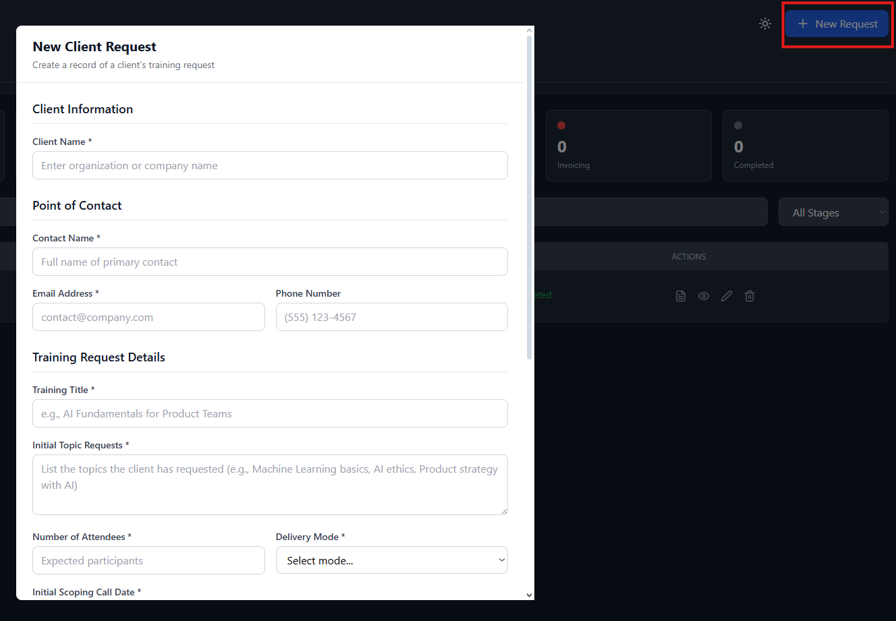
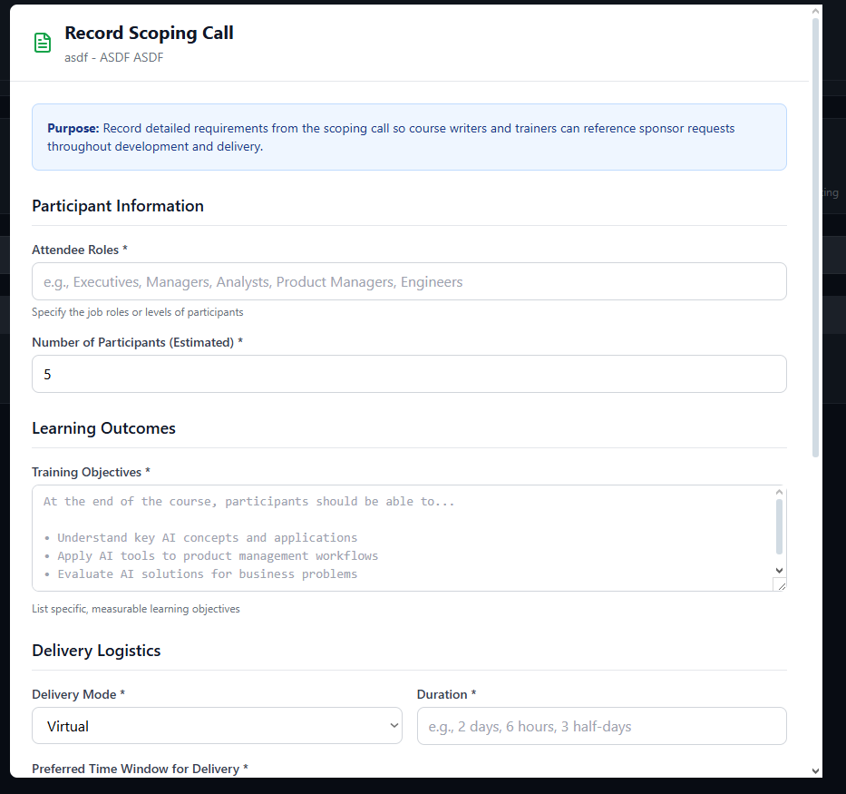
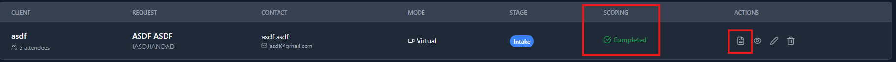
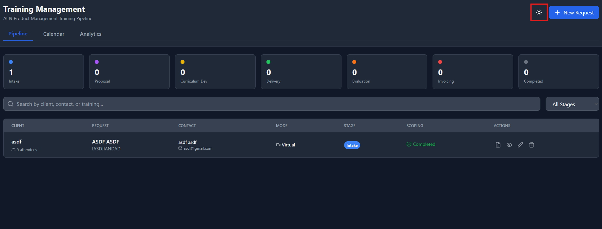
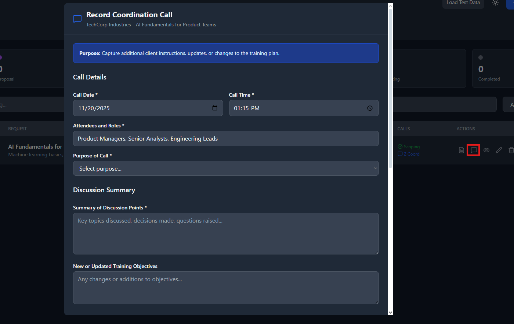
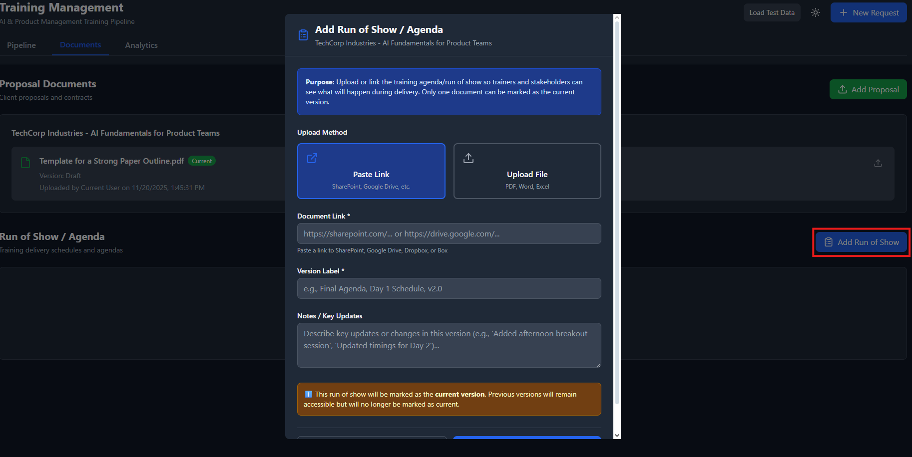
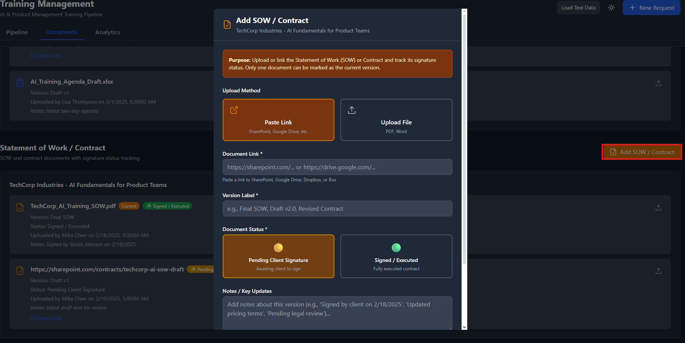
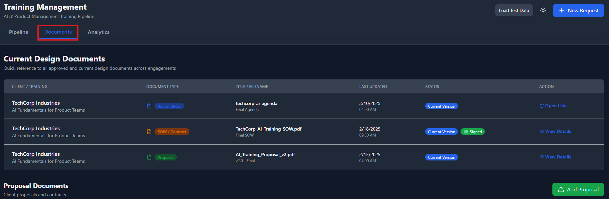

# Training Management Application

A comprehensive system for managing AI and Product Management training pipelines from initial client intake through delivery, evaluation, and invoicing.

## 🎯 Project Overview

This application was developed iteratively through conversation with Claude AI, with each feature built based on specific user stories and requirements. The app helps training managers track client requests, record scoping calls, manage the training development pipeline, and monitor progress through various stages.

## 📋 Development History & Prompts

### Initial Setup Prompt
**Prompt:**
> "Develop a Training Management Application that a company will use to manage their AI and Product Management training pipeline – intake, proposal & outline development, curriculum development, delivery, session evaluations, and invoicing."

**Result:** 
- Created base React application with 7 pipeline stages
- Implemented training CRUD operations
- Built analytics dashboard
- Added persistent storage

---

### User Story 1: Client Intake Form
**Prompt:**
> "As a trainer I want to create a record of a client's request so that I can track, share, and monitor the progress of training development, delivery and invoicing.
> 
> **Acceptance criteria:**
> Given: There is no client and/or engagement information in the system
> When: I create a new request
> Then I am prompted to enter the name of the client, the point of contact, their contact information, the initial topic requests, number of attendees, mode (virtual, in-person, or blended), and a date for the initial scoping call"

**Features Added:**
- Required fields for client name, contact information
- Contact name, email, and phone number fields
- Initial topic requests textarea
- Number of attendees field
- Delivery mode dropdown (Virtual, In-Person, Blended)
- Initial scoping call date picker
- Form validation with required field indicators

<details>
<summary>📸 View Client Intake Form Screenshot</summary>


*Add screenshot of the New Client Request modal*

</details>

---

### User Story 2: Scoping Call Recording
**Prompt:**
> "As a training manager I want to record results from a scoping call so that course writers and trainers can see and refer back to sponsors requests.
> 
> **Given:**
> - There is an existing training request in the system.
> - I have conducted or am conducting a scoping call with the client.
> 
> **When:**
> - I select "Record Scoping Call" from the training request dashboard or details page.
> 
> **Then:**
> I am presented with a fillable scoping call form that includes the following fields:
> - Attendee Roles: (e.g., Executives, Managers, Analysts, etc.)
> - Training Objectives: "At the end of the course, participants should be able to…" (Free-text)
> - Delivery Mode: (Dropdown – Virtual, On-site, Hybrid)
> - Duration: (e.g., 2 days, 3 hours)
> - Preferred Time Window for Delivery: (e.g., Q1 2025, next month, specific dates)
> - Number of Participants (Estimated)
> - Special Requirements / Constraints: (optional)
> - Notes / Additional Context: (free text)"

**Features Added:**
- "Record Scoping Call" button with FileText icon in actions column
- Comprehensive scoping call form with all required fields
- Scoping status indicator (Completed/Not recorded)
- Scoping call results displayed in training details view
- Purpose statement to guide form completion

<details>
<summary>📸 View Scoping Call Screenshots</summary>

### Scoping Call Form

*Add screenshot of the Record Scoping Call modal*

### Scoping Status Indicator

*Add screenshot showing the scoping status in the table*

</details>

---

### User Story 3: Theme Toggle
**Prompt:**
> "Could you create an option to switch between light and dark themes?"

**Features Added:**
- Theme toggle button in header (Sun/Moon icons)
- Complete dark mode styling for all components
- Persistent theme preference saved to storage
- Smooth color transitions between themes
- Accessible color contrast in both modes

<details>
<summary>📸 View Theme Screenshots</summary>

### Dark Mode

*Add screenshot of the application in dark mode*

</details>

---

### User Story 4: Coordination Call Recording
**Prompt:**
> "As a training manager, I want to log coordination calls so I can capture additional client instructions, updates, or changes to the training plan.
> 
> **Acceptance Criteria:**
> 
> **Given:**
> - There is a training request in the system.
> - A scoping call has been completed for this request.
> - I have had or am about to have a follow-up coordination call with the client.
> 
> **When:**
> - I click the "Record Coordination Call" action on a training request with a completed scoping call.
> 
> **Then:**
> I am presented with a Coordination Call form with the following fields:
> - **Call Date** (Date picker) *
> - **Call Time** (Time picker) *
> - **Attendees and Roles** (e.g., "Sarah Johnson (Client), Mike Chen (Trainer)") *
> - **Purpose of Call** (Dropdown: Logistics Update, Additional Content Requests, Instructor Confirmation, Participant Confirmation, Schedule Changes, Materials Review, General Coordination, Other) *
> - **Summary of Discussion Points** (Free-text, multi-line) *
> - **New or Updated Training Objectives** (Free-text, multi-line, optional)
> - **Additional Materials Requested** (Free-text, multi-line, optional)
> - **Changes to Delivery Mode, Dates, or Duration** (Free-text, multi-line, optional)
> - **Follow-Up Actions and Responsible Parties** (Free-text, multi-line) * (Example: "• Update participant list - Sarah - 3/15/2025")
> - **Notes / Client Instructions** (Free-text, optional)
> 
> **And:**
> - The coordination call is saved and associated with the training request.
> - Multiple coordination calls can be logged per request.
> - A visual indicator (e.g., counter or icon) on the training request shows how many coordination calls have been logged.
> - In the detailed view of a training request, I can see all coordination calls in chronological order.
> - The coordination call action is only enabled after a scoping call is completed."

**Features Added:**
- "Record Coordination Call" button with MessageSquare icon in actions column
- Button is disabled until scoping call is completed (with tooltip)
- Comprehensive coordination call form with all required fields
- Call purpose dropdown with predefined options
- Follow-up actions field with formatting guidance
- Multiple coordination calls can be logged per training
- Counter in pipeline table showing number of coordination calls
- Visual indicator (blue badge) for coordination calls
- Chronological display of all coordination calls in training details view
- Color-coded display (blue theme) to distinguish from scoping calls
- Purpose statement banner explaining the feature

<details>
<summary>📸 View Coordination Call Screenshots</summary>

### Coordination Call Form

*Add screenshot of the Record Coordination Call modal*

### Coordination Call Indicator

*Add screenshot showing the coordination call counter in the pipeline table*

### Coordination Call History

*Add screenshot showing multiple coordination calls in the training details view*

</details>

---

### User Story 5: Email Communication Logging
**Prompt:**
> "As a training manager, I want to log email communications so that I can maintain a complete history of all project-related correspondence for context, accountability, and transparency.
> 
> **Acceptance Criteria:**
> 
> **Given:**
> - There is a training request in the system.
> - I have sent or received an email related to this training.
> 
> **When:**
> - I click "Add Email Communication" from the training request actions.
> 
> **Then:**
> I am presented with an Email Communication form with the following fields:
> - **Sender Name** (Text field) *
> - **Sender Email** (Email field) *
> - **Recipient(s)** (Text field, comma-separated) *
> - **Subject Line** (Text field) *
> - **Email Body** (Large text area, multi-line) *
> - **Attachments** (Text field for listing attachment filenames, comma-separated, optional)
> - **Timestamp** (Auto-populated with current date/time)
> 
> **And:**
> - The email communication is saved and associated with the training request.
> - Multiple emails can be logged per request.
> - A visual indicator (e.g., counter or icon) shows how many emails have been logged.
> - In the detailed view, I can see all emails in chronological order.
> - Email bodies preserve basic formatting (line breaks)."

**Features Added:**
- "Add Email Communication" button with Inbox icon in actions column
- Comprehensive email logging form with all required fields
- Sender information fields (name and email)
- Recipients field supporting multiple email addresses
- Subject line field
- Large text area for email body (preserves formatting with monospace font)
- Attachments field for listing filenames (note: actual files not uploaded)
- Automatic timestamp on save
- Multiple emails can be logged per training
- Counter in pipeline table showing number of emails logged
- Visual indicator (purple badge) for email communications
- Chronological display of all emails in training details view
- Color-coded display (purple theme) to distinguish from calls
- Purpose statement banner explaining the feature
- Expandable email body view with proper formatting

<details>
<summary>📸 View Email Communication Screenshots</summary>

### Email Communication Form

*Add screenshot of the Add Email Communication modal*

### Email Indicator

*Add screenshot showing the email counter in the pipeline table*

### Email History Display

*Add screenshot showing multiple emails in the training details view*

</details>

---

### User Story 6: Proposal Document Management
**Prompt:**
> "As a training manager, I want to upload or link to proposal documents so that all stakeholders can access the most recent proposal and see the version history.
> 
> **Acceptance Criteria:**
> 
> **Given:**
> - There is a training request in the system.
> - I have a proposal document ready to share (either as a file or as a link).
> 
> **When:**
> - I navigate to the "Documents" tab or click "Add Proposal" from the training request actions.
> 
> **Then:**
> I am presented with a Proposal Document form with the following options and fields:
> 
> **Upload Method Selection:**
> - Option 1: **Paste Link** (for SharePoint, Google Drive, Dropbox, Box, etc.)
> - Option 2: **Upload File** (PDF, DOCX, PPTX - max 10MB)
> 
> **If Paste Link is selected:**
> - **Document Link** (URL field, validated for common cloud storage domains) *
> 
> **If Upload File is selected:**
> - **File Upload** (File picker with drag-and-drop support) *
> - Accepted formats: .pdf, .docx, .pptx
> - Note displayed: "In this demo, file content is not actually uploaded. Only the filename is stored."
> 
> **Common Fields:**
> - **Version Label** (Text field, e.g., "v1.0", "Draft", "Final", "2025-01-15") *
> - **Notes** (Text area, optional, for additional context about this version)
> 
> **And:**
> - When I save the proposal:
>   - The document is marked as the **current version**
>   - Any previous versions remain accessible but are no longer marked as current
>   - The system records: upload date, uploaded by (user), filename/link
> - A "Documents" tab shows all proposal documents across all trainings
> - Each training's proposal section displays:
>   - All versions in reverse chronological order
>   - Clear indication of which is the current version
>   - Version label, upload date, uploader, and notes
>   - Link to open (if cloud link) or download (if file)
> - Multiple versions can exist, but only one is marked "Current" at a time
> - Visual indicator shows which trainings have proposals uploaded"

**Features Added:**
- **New "Documents" Tab** in main navigation
- **"Add Proposal" button** with Upload icon
- **Dual Upload Method Selection:**
  - Paste Link option with URL validation for cloud storage (SharePoint, Google Drive, Dropbox, Box)
  - Upload File option with drag-and-drop interface (PDF, DOCX, PPTX)
- **Version Control System:**
  - Version label field (required)
  - Notes field (optional)
  - Automatic marking of current version (only one active at a time)
  - Upload timestamp and user tracking
  - All historical versions remain accessible
- **Documents Tab Display:**
  - Grouped by training engagement
  - All proposal versions shown in reverse chronological order
  - Current version badge (green)
  - File information (name, size, type for uploads)
  - External link icon for cloud storage links
  - Add new version button per training
- **File Upload Features:**
  - File type validation (PDF, DOCX, PPTX only)
  - File size limit (10MB)
  - Visual file preview after selection
  - Note: Demo only stores filename, not actual file content
- **URL Validation:**
  - Checks for valid URL format
  - Validates against approved cloud storage domains
  - Warning message for invalid URLs
- **Visual Indicators:**
  - Purpose statement banner explaining version control
  - Info banner explaining current version marking
  - Color-coded proposal cards (green theme)
  - Icon differentiation (File icon vs External Link icon)

<details>
<summary>📸 View Proposal Document Screenshots</summary>

### Proposal Upload Modal - Link Option

*Add screenshot of the proposal modal with link paste option selected*

### Proposal Upload Modal - File Option

*Add screenshot of the proposal modal with file upload option selected*

### Documents Tab View

*Add screenshot of the Documents tab showing multiple proposals with version history*

### Proposal Version History

*Add screenshot showing multiple versions of a proposal with current version highlighted*

</details>

---

### User Story 7: Run of Show / Agenda Management
**Prompt:**
> "As a Training Manager, I want to upload or link the current version of the Run of Show or Agenda, so that trainers and stakeholders can see what will happen during the delivery.
> 
> **Acceptance Criteria:**
> 
> **Given:**
> - A training request exists in the system.
> 
> **When:**
> - I choose "Add Run of Show" under the engagement's document section.
> 
> **Then:**
> - I can upload or link an Excel/Word/PDF file
> - I can add a note describing key updates
> - The document is marked as the current version
> - Trainers and stakeholders can access the current agenda"

**Features Added:**
- **"Add Run of Show" button** in Documents tab with ClipboardList icon
- **Dual Upload Method Selection:**
  - Paste Link option with URL validation for cloud storage (SharePoint, Google Drive, Dropbox, Box)
  - Upload File option with drag-and-drop interface (PDF, DOCX, DOC, XLSX, XLS)
- **Dedicated Run of Show Section** in Documents tab (separate from Proposals)
- **Version Control System:**
  - Version label field (required)
  - Notes field for describing key updates (optional)
  - Automatic marking of current version (only one active at a time)
  - Upload timestamp and user tracking
  - All historical versions remain accessible
- **Run of Show Display:**
  - Grouped by training engagement
  - All versions shown in reverse chronological order
  - Current version badge (blue)
  - File information (name, size, type for uploads)
  - External link icon for cloud storage links
  - Add new version button per training
- **File Upload Features:**
  - File type validation (PDF, Word, Excel only)
  - File size limit (10MB)
  - Visual file preview after selection
  - Note: Demo only stores filename, not actual file content
- **URL Validation:**
  - Checks for valid URL format
  - Validates against approved cloud storage domains
  - Warning message for invalid URLs
- **Visual Indicators:**
  - Purpose statement banner explaining the feature
  - Info banner explaining current version marking
  - Color-coded run of show cards (blue theme)
  - ClipboardList icon differentiation from proposals

<details>
<summary>📸 View Run of Show Screenshots</summary>

### Run of Show Upload Modal - Link Option

*Add screenshot of the run of show modal with link paste option selected*

### Run of Show Upload Modal - File Option

*Add screenshot of the run of show modal with file upload option selected*

### Documents Tab - Run of Show Section

*Add screenshot of the Documents tab showing the Run of Show section with multiple versions*

### Run of Show Version History

*Add screenshot showing multiple versions of a run of show with current version highlighted*

</details>

---

### User Story 8: SOW / Contract Document Management with Status Tracking
**Prompt:**
> "As a Training Manager or Administrator,
> I want to upload or link the Statement of Work (SOW) or Contract and mark its current status,
> so that the team can track whether the agreement has been sent, is awaiting signature, or has been fully executed.
>
> **Given / When / Then:**
>
> **Given:**
> - A training engagement exists, and the proposal phase is complete.
>
> **When:**
> - I select "Add SOW / Contract" from the engagement record.
>
> **Then:**
> - I can upload or link the document (Word, PDF, or SharePoint link).
> - I am prompted to set the document Status as:
>   - 🟡 Pending Client Signature, or
>   - 🟢 Signed / Executed.
> - The SOW/Contract record displays in the engagement's document list with the selected status."

**Features Added:**
- **"Add SOW / Contract" button** in Documents tab and pipeline table with FileCheck icon
- **Dual Upload Method Selection:**
  - Paste Link option with URL validation for cloud storage (SharePoint, Google Drive, Dropbox, Box)
  - Upload File option with drag-and-drop interface (PDF, DOCX, DOC)
- **Signature Status Tracking:**
  - 🟡 **Pending Client Signature** - Document awaiting client execution
  - 🟢 **Signed / Executed** - Fully executed contract
  - Visual status badges with emoji indicators
  - Status selection during upload with clear UI indicators
- **Dedicated SOW/Contract Section** in Documents tab (separate from Proposals and Run of Show)
- **Version Control System:**
  - Version label field (required)
  - Notes field for describing version details (optional)
  - Automatic marking of current version (only one active at a time)
  - Upload timestamp and user tracking
  - All historical versions remain accessible with their status
- **SOW/Contract Display:**
  - Grouped by training engagement
  - All versions shown in reverse chronological order
  - Current version badge (amber)
  - Status badges (green for signed, yellow for pending)
  - File information (name, size, type for uploads)
  - External link icon for cloud storage links
  - Add new version button per training
- **Action Button Integration:**
  - FileCheck icon button in pipeline table actions column
  - Quick access to add SOW/Contract from any training
  - Color-coded amber theme for visual distinction
- **File Upload Features:**
  - File type validation (PDF, Word only - appropriate for contracts)
  - File size limit (10MB)
  - Visual file preview after selection
  - Note: Demo only stores filename, not actual file content
- **URL Validation:**
  - Checks for valid URL format
  - Validates against approved cloud storage domains
  - Warning message for invalid URLs
- **Visual Indicators:**
  - Purpose statement banner explaining the feature
  - Info banner explaining current version marking
  - Color-coded SOW/Contract cards (amber theme)
  - FileCheck icon differentiation from proposals and run of show
  - Dual status badges (Current + Signature Status)

<details>
<summary>📸 View SOW / Contract Screenshots</summary>

### SOW Upload Modal - Status Selection

*Screenshot of the SOW modal showing the dual status options: Pending Client Signature (🟡) and Signed/Executed (🟢)*

### SOW Upload Modal - Link Option

*Screenshot of the SOW modal with link paste option selected*

### SOW Upload Modal - File Option

*Screenshot of the SOW modal with file upload option selected*

### Documents Tab - SOW/Contract Section

*Screenshot of the Documents tab showing the SOW/Contract section with status badges*

### SOW Version History with Status

*Screenshot showing multiple versions of a SOW with different statuses (pending and signed) and current version highlighted*

### Pipeline Table - SOW Action Button

*Screenshot showing the FileCheck icon button in the pipeline table actions*

</details>

---

### User Story 9: View All Current Design Documents in Engagement Dashboard
**Prompt:**
> "As a Trainer or Training Manager,
> I want to view the most current versions of the proposal, run of show, and SOW/contract in one place,
> so that I can quickly reference the client's approved design and expectations.
>
> **Given / When / Then:**
>
> **Given:**
> - One or more design documents are stored.
>
> **When:**
> - I open the "Design & Confirm Training Solution" or "Documents" tab of an engagement.
>
> **Then:**
> - I see a list showing:
>   - Document Type
>   - Title / Filename
>   - Last Updated Date
>   - Link to open/download
>   - "Current Version" indicator"

**Features Added:**
- **Current Design Documents Overview Section** - Positioned at the top of the Documents tab
- **Consolidated Table View** displaying all current documents across all engagements:
  - Client Name and Training Title
  - Document Type with color-coded badges (Proposal, Run of Show, SOW/Contract)
  - Title/Filename with version label
  - Last Updated Date and Time
  - Status indicators (Current Version + Signature Status for SOW)
  - Action buttons (Open Link or View Details)
- **Smart Document Collection System:**
  - Automatically finds current version (isCurrent: true) from each document type
  - Aggregates proposals, run of show, and SOW/contracts across all training engagements
  - Sorts by most recently updated (newest first)
  - Empty state when no documents exist
- **Color-Coded Document Type Badges:**
  - Green badge for Proposals with File icon
  - Blue badge for Run of Show with ClipboardList icon
  - Amber badge for SOW/Contract with FileCheck icon
- **Status Indicators:**
  - "Current Version" badge displayed for all documents
  - "🟢 Signed" or "🟡 Pending" badges for SOW documents with signature status
- **Quick Access Actions:**
  - "Open Link" button for cloud storage documents (opens in new tab)
  - "View Details" button for file uploads (opens training details modal)
  - External link icon and Eye icon for visual clarity
- **Responsive Table Design:**
  - Clean, organized layout with all key information
  - Hover effects for better interactivity
  - Dark mode support
  - Scrollable on smaller screens
- **One-Stop Reference Dashboard:**
  - No need to scroll through individual document sections
  - See all approved design documents at a glance
  - Quickly identify which clients have which documents ready
  - Track most recently updated documents

<details>
<summary>📸 View Current Design Documents Screenshots</summary>

### Current Design Documents Dashboard

*Screenshot of the consolidated current design documents table showing proposals, run of show, and SOW documents across multiple engagements*

### Current Documents with Status Badges

*Screenshot showing the various status badges including "Current Version", "🟢 Signed", and "🟡 Pending"*

### Current Documents - Empty State

*Screenshot showing the empty state when no current documents exist*

### Current Documents - Dark Mode

*Screenshot of the current design documents dashboard in dark mode*

</details>

---

### User Story 10: Proposal-to-Contract Conversion Tracking Analytics
**Prompt:**
> "As an Administrator or Business Lead,
> I want to track how many proposals result in signed contracts,
> so that I can measure conversion performance and forecast revenue potential.
>
> **Given / When / Then:**
>
> **Given:**
> - Proposals and signed SOWs are stored across engagements.
>
> **When:**
> - I view the analytics or dashboard screen.
>
> **Then:**
> - I see:
>   - Number of proposals sent
>   - Number of contracts signed
>   - Conversion rate (%)"

**Features Added:**
- **Proposal to Contract Conversion Section** - New dedicated section in Analytics tab
- **Three New Analytics Cards:**
  - **Proposals Sent** - Count of engagements that have at least one proposal document
  - **Contracts Signed** - Count of engagements with fully executed SOWs (status = "Signed / Executed")
  - **Conversion Rate** - Percentage showing proposal-to-contract success rate
- **Smart Calculation Logic:**
  - Proposals Sent: Counts trainings with `proposalDocuments.length > 0`
  - Contracts Signed: Counts trainings where SOW has `status === 'Signed / Executed'`
  - Conversion Rate: `(Contracts Signed / Proposals Sent) × 100`
  - Handles edge cases (displays 0% when no proposals exist)
  - Shows breakdown text (e.g., "2 of 3 proposals")
- **Color-Coded Status Indicators:**
  - **Green TrendingUp icon** (≥50%): Strong conversion performance
  - **Yellow TrendingUp icon** (≥25%): Moderate conversion performance
  - **Red TrendingUp icon** (<25%): Needs improvement
  - Dynamic color coding helps identify performance at a glance
- **Card Design:**
  - Proposals Sent: File icon in green
  - Contracts Signed: FileCheck icon in amber
  - Conversion Rate: TrendingUp icon with dynamic color
  - Descriptive subtext under each metric
  - Consistent styling with existing analytics cards
- **Business Value Metrics:**
  - Track proposal success rates over time
  - Measure sales/business development performance
  - Forecast revenue potential based on conversion trends
  - Identify opportunities for sales process improvement
- **Visual Organization:**
  - Separated from general metrics with clear heading
  - Three-column grid layout matching existing analytics
  - Dark mode support
  - Responsive design

<details>
<summary>📸 View Conversion Analytics Screenshots</summary>

### Conversion Analytics Cards

*Screenshot showing the three conversion analytics cards: Proposals Sent, Contracts Signed, and Conversion Rate*

### Conversion Rate - Strong Performance

*Screenshot showing conversion rate with green indicator (≥50%)*

### Conversion Rate - Moderate Performance

*Screenshot showing conversion rate with yellow indicator (25-49%)*

### Conversion Rate - Needs Improvement

*Screenshot showing conversion rate with red indicator (<25%)*

### Analytics Tab - Full View

*Screenshot of the complete Analytics tab showing both general metrics and conversion tracking*

</details>

---

### User Story 11: Master Schedule with List and Calendar Views
**Prompt:**
> "As a Training Manager or Administrator,
> I want to view all scheduled training sessions in a list and calendar format,
> so that I can see what's coming up and easily access event details.
>
> **Given / When / Then:**
>
> **Given:**
> - One or more training events have been scheduled.
>
> **When:**
> - I open the "Plan & Schedule Delivery" section.
>
> **Then:**
> - I see a Master Schedule List View showing:
>   - Event / Course Title
>   - Client Name
>   - Date & Time (Start–End)
>   - Delivery Mode (Virtual, On-site, Hybrid)
>   - Location or Virtual Link
>   - Instructor
>   - Facilitators (if any)
>   - Status (Tentative / Confirmed / Completed)
> - I can toggle to a Calendar View that displays each event by date.
> - In Calendar View, each entry shows Client Name and Event Title."

**Features Added:**
- **New Schedule Tab** - Added to main navigation between Documents and Analytics
- **Scheduled Sessions Data Model:**
  - Event/Course Title
  - Start Date & Time, End Date & Time
  - Delivery Mode (Virtual, On-site, Hybrid)
  - Location and Virtual Link fields
  - Instructor name
  - Facilitators array (multiple team members)
  - Status (Tentative / Confirmed / Completed)
- **View Toggle Control:**
  - Switch between List View and Calendar View
  - Clean button-based toggle interface
  - Persistent view state during session
  - Color-coded active view indicator
- **List View Features:**
  - **Comprehensive Table Display** with all session details
  - **Chronological Sorting** - Sessions ordered by date and time (earliest first)
  - **Client Name Column** - Quickly identify which client each session is for
  - **Date & Time Display** - Full date with start–end time range
  - **Delivery Mode Badges:**
    - Blue badge for Virtual sessions
    - Green badge for On-site sessions
    - Purple badge for Hybrid sessions
  - **Smart Location/Link Display:**
    - Virtual sessions: Clickable "Join Meeting" link with ExternalLink icon
    - On-site sessions: Location with MapPin icon
    - Hybrid sessions: Both virtual link and physical location
  - **Instructor & Facilitators:**
    - Primary instructor name displayed
    - Facilitator count badge (e.g., "+2 facilitators")
  - **Status Badges:**
    - Green for Confirmed sessions
    - Yellow for Tentative sessions
    - Gray for Completed sessions
  - **Empty State** - Helpful message when no sessions are scheduled
- **Calendar View Features:**
  - **Date-Based Grouping** - Sessions organized by date
  - **Full Date Display** - Weekday, month, day, year (e.g., "Thursday, March 20, 2025")
  - **Session Count** - Shows how many sessions on each date
  - **Compact Session Cards:**
    - Client Name and Event Title prominently displayed
    - Time range with Clock icon
    - Instructor with Users icon
    - Virtual meeting link with Video icon ("Join" button)
    - Physical location with MapPin icon (for on-site/hybrid)
    - Status badge (Confirmed/Tentative/Completed)
  - **Upcoming Sessions Header** - Clear section title
  - **Empty State** - Helpful message when no sessions are scheduled
- **Visual Design:**
  - Consistent color scheme matching app theme
  - Dark mode support throughout
  - Responsive table and card layouts
  - Hover effects for better interactivity
  - Icon usage for visual clarity (Calendar, Clock, Users, MapPin, Video, ExternalLink)
- **Test Data Included:**
  - 2 sample sessions (Day 1 & Day 2 AI training)
  - Demonstrates Hybrid delivery mode
  - Shows multiple facilitators
  - Confirmed status
  - Scheduled for March 2025

<details>
<summary>📸 View Master Schedule Screenshots</summary>

### List View - Master Schedule

*Screenshot of the Master Schedule List View showing all session details in a comprehensive table format*

### List View - Delivery Mode Badges

*Screenshot showing the color-coded delivery mode badges (Virtual, On-site, Hybrid)*

### List View - Status Badges

*Screenshot showing the status badges (Confirmed, Tentative, Completed)*

### Calendar View - Date Grouping

*Screenshot of the Calendar View showing sessions grouped by date with full date display*

### Calendar View - Session Cards

*Screenshot showing the compact session cards with time, instructor, location, and virtual link details*

### View Toggle

*Screenshot showing the toggle between List View and Calendar View*

### Empty State

*Screenshot showing the empty state when no sessions are scheduled*

### Add Session Modal

*Screenshot of the Add Session modal showing all form fields for creating a new training session*

### Add Session Modal - Delivery Mode

*Screenshot showing the delivery mode selector buttons (Virtual/On-site/Hybrid) with color-coding*

### Add Session Modal - Status Selection

*Screenshot showing the status selector buttons (Tentative/Confirmed/Completed)*

</details>

---

## 🚀 Features

### Core Functionality
- **Pipeline Management**: Track trainings through 7 stages (Intake → Proposal → Curriculum Dev → Delivery → Evaluation → Invoicing → Completed)
- **Client Intake**: Capture detailed client and training request information
- **Scoping Call Recording**: Document requirements from client scoping calls
- **Coordination Call Tracking**: Log follow-up calls with clients to capture updates and changes
- **Email Communication Logging**: Maintain complete email correspondence history
- **Proposal Document Management**: Version-controlled proposal documents with cloud storage integration
- **Run of Show / Agenda Management**: Version-controlled training agendas and delivery schedules
- **SOW / Contract Management**: Version-controlled contract documents with signature status tracking (Pending/Signed)
- **Current Design Documents Dashboard**: Consolidated view of all current design documents across engagements
- **Master Schedule**: View all scheduled training sessions in List and Calendar formats with full event details
- **Conversion Analytics**: Track proposal-to-contract conversion rates and business performance metrics
- **Search & Filter**: Find trainings by client name, contact, or training title
- **Stage-based Views**: Filter trainings by pipeline stage
- **Analytics Dashboard**: View total pipeline value, active requests, completed trainings, and conversion metrics

### User Interface
- **Light/Dark Mode**: Toggle between themes with persistent preference
- **Responsive Design**: Works on desktop and mobile devices
- **Modal Forms**: Clean, organized forms for data entry
- **Visual Indicators**: Color-coded stage badges and status icons
- **Action Buttons**: Quick access to view, edit, record, and delete operations
- **Tabbed Navigation**: Pipeline, Documents, Schedule, and Analytics views

### Data Management
- **Persistent Storage**: All data saved automatically using browser storage
- **CRUD Operations**: Create, read, update, and delete training records
- **Data Validation**: Required field validation on forms
- **Timestamps**: Automatic tracking of creation and update times
- **Version Control**: Proposal documents with version tracking

### Communication History
- **Chronological Timeline**: All communications displayed in order
- **Color-Coded Events**: 
  - Purple for emails
  - Blue for coordination calls
  - Green for scoping calls
- **Complete Context**: Full email bodies, call summaries, and notes preserved
- **Visual Indicators**: Badges showing number of each communication type

## 🛠️ Technologies

- **React 19.2** - UI framework
- **Vite 7.2** - Build tool and development server
- **Tailwind CSS 3.4** - Utility-first CSS framework
- **Lucide React** - Icon library
- **Browser Storage API** - Data persistence (with localStorage fallback)

## 📦 Installation

```bash
# Clone the repository
git clone https://github.com/blpearson26/TrainPipeline-Claude.git

# Navigate to project directory
cd TrainPipeline-Claude

# Install dependencies
npm install

# Start development server
npm run dev

# Build for production
npm run build

# Preview production build
npm run preview
```

## 🎨 Project Structure

```
training-management-app/
├── .github/
│   └── workflows/
│       └── deploy.yml          # GitHub Actions deployment
├── src/
│   ├── App.jsx                 # Main application component
│   ├── main.jsx                # Entry point
│   └── index.css               # Tailwind imports
├── public/
├── screenshots/                # Application screenshots
├── vite.config.js              # Vite configuration
├── package.json
└── README.md
```

## 📊 Data Model

### Training Request Object
```javascript
{
  id: "TR1234567890",
  clientName: "Acme Corporation",
  contactName: "John Smith",
  contactEmail: "john@acme.com",
  contactPhone: "(555) 123-4567",
  title: "AI Fundamentals for Product Teams",
  topicRequests: "Machine learning, AI ethics, practical applications",
  attendees: 25,
  deliveryMode: "Hybrid",
  scopingCallDate: "2025-02-01",
  stage: "intake",
  value: 50000,
  deliveryDate: "2025-03-15",
  
  // Scoping Call
  scopingCallCompleted: true,
  scopingCall: {
    attendeeRoles: "Product Managers, Engineers, Executives",
    trainingObjectives: "Participants will be able to...",
    deliveryMode: "Hybrid",
    duration: "2 days",
    preferredTimeWindow: "Q1 2025",
    numberOfParticipants: 25,
    specialRequirements: "Projector, breakout rooms",
    notes: "Client prefers morning sessions",
    completedDate: "2025-01-20"
  },
  
  // Coordination Calls (Multiple)
  coordinationCalls: [
    {
      id: "CC001",
      callDate: "2025-02-20",
      callTime: "14:00",
      attendeesAndRoles: "Sarah Johnson (Client), Mike Chen (Trainer)",
      callPurpose: "Logistics Update",
      discussionSummary: "Confirmed room setup and technical requirements",
      updatedObjectives: "Added focus on generative AI tools",
      additionalMaterials: "Client requested fintech case studies",
      deliveryChanges: "Changed start time from 9am to 8:30am",
      followUpActions: "• Send agenda - Mike - 2/25\n• Prepare case studies - Lisa - 3/1",
      notes: "Client mentioned potential follow-up course"
    }
  ],
  
  // Email Communications (Multiple)
  emailCommunications: [
    {
      id: "EM001",
      timestamp: "2025-02-12T09:30:00Z",
      senderName: "Sarah Johnson",
      senderEmail: "sarah@techcorp.com",
      recipients: "training@company.com",
      subject: "Initial Training Request - AI Fundamentals",
      body: "Full email body text...",
      attachments: ["proposal_draft.pdf", "requirements.docx"]
    }
  ],
  
  // Proposal Documents (Multiple Versions)
  proposalDocuments: [
    {
      id: "PR001",
      fileName: "AI_Training_Proposal_v2.pdf", // or null if link
      linkUrl: null, // or "https://sharepoint.com/..." if link
      versionLabel: "v2.0 - Final",
      notes: "Updated pricing and added case studies",
      isCurrent: true,
      uploadedAt: "2025-02-15T10:00:00Z",
      uploadedBy: "Current User"
    },
    {
      id: "PR002",
      fileName: null,
      linkUrl: "https://sharepoint.com/proposals/v1",
      versionLabel: "v1.0 - Draft",
      notes: "Initial proposal draft",
      isCurrent: false,
      uploadedAt: "2025-02-10T14:30:00Z",
      uploadedBy: "Current User"
    }
  ],
  
  // Run of Show Documents (Multiple Versions)
  runOfShowDocuments: [
    {
      id: "ROS001",
      fileName: null,
      linkUrl: "https://sharepoint.com/agendas/final",
      versionLabel: "Final Agenda",
      notes: "Updated with fintech case studies in afternoon session",
      isCurrent: true,
      uploadedAt: "2025-03-10T09:00:00Z",
      uploadedBy: "Current User"
    },
    {
      id: "ROS002",
      fileName: "AI_Training_Agenda_Draft.xlsx",
      linkUrl: null,
      versionLabel: "Draft v1",
      notes: "Initial two-day agenda",
      isCurrent: false,
      uploadedAt: "2025-03-01T14:30:00Z",
      uploadedBy: "Current User"
    }
  ],

  // SOW / Contract Documents (Multiple Versions with Status)
  sowDocuments: [
    {
      id: "SOW001",
      fileName: "TechCorp_AI_Training_SOW.pdf",
      linkUrl: null,
      versionLabel: "Final SOW",
      status: "Signed / Executed", // or "Pending Client Signature"
      notes: "Signed by Sarah Johnson on 2/18/2025",
      isCurrent: true,
      uploadedAt: "2025-02-18T15:30:00Z",
      uploadedBy: "Current User"
    },
    {
      id: "SOW002",
      fileName: null,
      linkUrl: "https://sharepoint.com/contracts/techcorp-ai-sow-draft",
      versionLabel: "Draft v1",
      status: "Pending Client Signature",
      notes: "Initial draft sent for review",
      isCurrent: false,
      uploadedAt: "2025-02-10T11:00:00Z",
      uploadedBy: "Current User"
    }
  ],

  createdAt: "2025-01-15T10:30:00Z",
  updatedAt: "2025-02-20T14:45:00Z"
}
```

## 🎯 Pipeline Stages

1. **Intake** - Initial client request captured
2. **Proposal** - Training proposal being developed
3. **Curriculum Dev** - Course content being created
4. **Delivery** - Training is being delivered
5. **Evaluation** - Post-training assessment
6. **Invoicing** - Billing and payment processing
7. **Completed** - Training engagement finished

## 🔐 Storage

The application uses a storage adapter that works in both environments:
- **Claude Artifacts**: Uses `window.storage` API
- **Browser/Production**: Falls back to `localStorage`

All data is stored with keys prefixed by `training:` for easy organization.

## 🚀 Deployment

The application automatically deploys to GitHub Pages via GitHub Actions on every push to the main branch.

**Live URL:** `https://blpearson26.github.io/TrainPipeline-Claude/`

### Deployment Configuration
- GitHub Actions workflow: `.github/workflows/deploy.yml`
- Build output: `dist/`
- Base URL configured in `vite.config.js`

## 📝 Usage Examples

### Creating a New Client Request
1. Click "New Request" button in the header
2. Fill in all required fields marked with asterisks (*)
3. Click "Create Request"

### Recording a Scoping Call
1. Find the training request in the pipeline table
2. Click the FileText icon (Record Scoping Call)
3. Fill in the scoping call form
4. Click "Save Scoping Call"

### Recording a Coordination Call
1. Ensure scoping call is completed first
2. Click the MessageSquare icon (Record Coordination Call)
3. Select call purpose and fill in details
4. Document discussion, updates, and follow-up actions
5. Click "Save Coordination Call"

### Logging Email Communications
1. Click the Inbox icon on any training
2. Enter sender information and recipients
3. Add subject line and paste full email body
4. List any attachments (filenames only)
5. Click "Add Email to Record"

### Adding Proposal Documents
1. Navigate to "Documents" tab or click Upload icon
2. Choose upload method: Link or File
3. **If using Link:**
   - Paste cloud storage URL (SharePoint, Google Drive, etc.)
4. **If using File:**
   - Select PDF, DOCX, or PPTX file (max 10MB)
   - Note: Demo only stores filename
5. Enter version label (e.g., "v1.0", "Final Draft")
6. Add optional notes about this version
7. Click "Add Proposal Document"
8. Document is automatically marked as current version

### Adding Run of Show / Agenda
1. Navigate to "Documents" tab
2. Scroll to "Run of Show / Agenda" section
3. Click "Add Run of Show" button
4. Choose upload method: Link or File
5. **If using Link:**
   - Paste cloud storage URL (SharePoint, Google Drive, etc.)
6. **If using File:**
   - Select PDF, Word (DOCX/DOC), or Excel (XLSX/XLS) file (max 10MB)
   - Note: Demo only stores filename
7. Enter version label (e.g., "Final Agenda", "Day 1 Schedule")
8. Add optional notes describing key updates
9. Click "Add Run of Show"
10. Document is automatically marked as current version

### Adding SOW / Contract Documents
1. Navigate to "Documents" tab or click FileCheck icon in pipeline table
2. Scroll to "Statement of Work / Contract" section (if on Documents tab)
3. Click "Add SOW / Contract" button
4. Choose upload method: Link or File
5. **If using Link:**
   - Paste cloud storage URL (SharePoint, Google Drive, etc.)
6. **If using File:**
   - Select PDF or Word (DOCX/DOC) file (max 10MB)
   - Note: Demo only stores filename
7. Enter version label (e.g., "Final SOW", "Draft v2.0", "Revised Contract")
8. **Select Document Status:**
   - Click 🟡 **Pending Client Signature** if awaiting client execution
   - Click 🟢 **Signed / Executed** if contract is fully signed
9. Add optional notes (e.g., "Signed by client on 2/18/2025", "Updated pricing terms")
10. Click "Add SOW / Contract"
11. Document is automatically marked as current version
12. Status badge displays alongside version information

### Viewing Current Design Documents Dashboard
1. Navigate to "Documents" tab
2. View the "Current Design Documents" section at the top
3. See consolidated table showing all current documents:
   - **Client/Training**: Client name and training title
   - **Document Type**: Color-coded badges (Green=Proposal, Blue=Run of Show, Amber=SOW)
   - **Title/Filename**: Document name and version label
   - **Last Updated**: Date and time of last update
   - **Status**: Current Version + Signature Status (for SOW documents)
   - **Action**: Open Link or View Details button
4. Documents are sorted by most recently updated (newest first)
5. Click "Open Link" to access cloud storage documents in a new tab
6. Click "View Details" to open the training engagement details

### Viewing Conversion Analytics
1. Navigate to "Analytics" tab
2. View the "Proposal to Contract Conversion" section
3. See three analytics cards:
   - **Proposals Sent**: Number of engagements with proposals
   - **Contracts Signed**: Number of fully executed SOWs
   - **Conversion Rate**: Success rate percentage with color indicator
4. Conversion rate color coding:
   - **Green** (≥50%): Strong conversion performance
   - **Yellow** (25-49%): Moderate conversion performance
   - **Red** (<25%): Needs improvement
5. View breakdown text showing ratio (e.g., "2 of 3 proposals")
6. Use metrics to:
   - Track proposal success rates
   - Measure business development performance
   - Forecast revenue potential
   - Identify sales process improvements

### Viewing Master Schedule
1. Navigate to "Schedule" tab
2. Choose your preferred view:
   - **List View** - Comprehensive table with all details
   - **Calendar View** - Sessions grouped by date
3. **List View features:**
   - See all scheduled sessions in one table
   - Sorted chronologically (earliest first)
   - Columns: Event Title, Client, Date & Time, Delivery Mode, Location/Link, Instructor, Status
   - Color-coded delivery mode badges (Blue=Virtual, Green=On-site, Purple=Hybrid)
   - Color-coded status badges (Green=Confirmed, Yellow=Tentative, Gray=Completed)
   - Click "Join Meeting" links for virtual sessions
   - View facilitator count for each session
4. **Calendar View features:**
   - Sessions grouped by date
   - Full date display with weekday
   - Session count per date
   - Compact cards showing:
     - Client name and event title
     - Time range with clock icon
     - Instructor with users icon
     - Virtual meeting "Join" link (if applicable)
     - Physical location (if applicable)
     - Status badge
5. Use schedule to:
   - See upcoming training sessions at a glance
   - Access virtual meeting links quickly
   - Check instructor assignments
   - Review session locations and times
   - Monitor session status (Tentative/Confirmed/Completed)

### Adding/Editing Training Sessions
1. Navigate to "Schedule" tab
2. Click "Add Session" button in the header
3. **Enter session details:**
   - **Event / Course Title**: Name of the training session (e.g., "AI Fundamentals - Day 1")
   - **Start Date & Time**: When the session begins
   - **End Date & Time**: When the session ends
   - **Delivery Mode**: Select Virtual, On-site, or Hybrid
     - Blue button for Virtual
     - Green button for On-site
     - Purple button for Hybrid
   - **Location**: Physical location (required for On-site and Hybrid)
   - **Virtual Meeting Link**: Zoom/Teams link (required for Virtual and Hybrid)
   - **Instructor**: Primary instructor name
   - **Facilitators**: Comma-separated list of additional team members (optional)
   - **Status**: Select Tentative, Confirmed, or Completed
     - Yellow button for Tentative
     - Green button for Confirmed
     - Gray button for Completed
4. Click "Add Session" to save
5. Session appears in both List and Calendar views
6. Sessions are automatically sorted chronologically

### Viewing Communication History
1. Click the Eye icon on any training with communications
2. View complete chronological timeline:
   - 📧 Purple cards = Email communications
   - 💬 Blue cards = Coordination calls  
   - 📄 Green cards = Scoping call
3. All details preserved including timestamps

### Viewing Proposal Versions
1. Navigate to "Documents" tab
2. Find your training engagement
3. View all versions with:
   - Green "Current" badge on active version
   - Version labels and upload dates
   - Notes for each version
4. Click external link icon to open cloud storage links
5. Click Upload icon to add new version

### Switching Themes
1. Click the Sun/Moon icon in the header
2. Theme switches immediately and preference is saved

## 🤝 Contributing

This project was developed through iterative collaboration with Claude AI. Each feature was implemented based on specific user stories and acceptance criteria.

## 📄 License

MIT

## 🙏 Acknowledgments

- Built with guidance from Claude (Anthropic)
- Developed iteratively through conversation-driven development
- User stories and requirements provided by training management team

## 📞 Contact

For questions or support, please open an issue on GitHub.

---

**Note:** This application demonstrates the power of AI-assisted development, where features are built incrementally through natural language conversation and user story refinement.